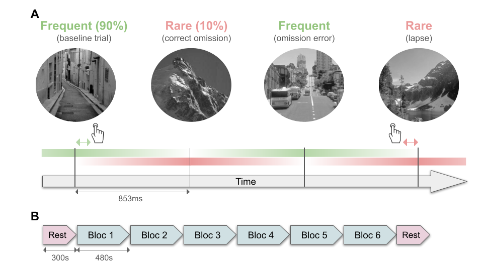

# Gradual Continuous Performance Task

A robust PsychoPy implementation of the gradual-onset continuous performance
task (GradCPT; Esterman et al. 2013). Optional thought probes, pluggable
hardware triggers (serial / parallel / LSL / none), online + offline
response-to-trial mapping, and BIDS-formatted output.

## About the task

GradCPT is a sustained-attention task in which scenes morph continuously into
one another. Participants respond to **frequent** (dominant) stimuli and
withhold on **rare** stimuli. Because each stimulus fades in over
`transition_time_s` rather than appearing abruptly, the task minimizes
low-level visual transients and yields a continuous, trial-by-trial readout of
attentional state suitable for downstream analyses like the Variance Time
Course (VTC).



**Figure 1. Gradual-onset Continuous Performance Task (gradCPT).**
**A.** Four consecutive trials illustrating the four event types this package
scores online and writes to `events.tsv`:

| Stimulus | Response | Event type |
|---|---|---|
| Frequent (dominant, ~90%) | press | **baseline / correct go** |
| Rare (target, ~10%) | no press | **correct omission** |
| Frequent | no press | **omission error** |
| Rare | press | **commission error (lapse)** |

The green/red bars show stimulus coherence rising from 0% → 100% → 0% over
~850 ms. The hand icons mark a keypress and the arrows indicate which trial
the press is assigned to (see [docs/algorithm.md](docs/algorithm.md) for the
unambiguous-zone heuristic).

**B.** Typical session structure used in published gradCPT studies (e.g.
Esterman 2013, Saflow): an eyes-open rest block, six task blocks, a closing
rest block. This package implements the task blocks — block count, trials per
block, and dominant-stimulus proportion are all configurable
(`task.n_blocks`, `task.n_trials`, `task.prop_dom`).

## Quickstart

```bash
# clone and enter the package
cd /path/to/gradcpt

# create a venv with uv (Python 3.10) and install in dev mode
uv venv --python 3.10
uv pip install -e ".[dev]"

# run the test suite (no display required)
uv run pytest
```

To actually run the experiment you also need PsychoPy. PsychoPy 2024.2.x
declares a broken transitive (`pypi-search`, not on PyPI) and on Linux its
`wxPython` dep only ships as source — install both with the bundled script:

```bash
./scripts/install_psychopy.sh
uv run gradcpt run --subject pilot01 --bids-root ./bids
```

The script installs the prebuilt wxPython wheel for your distro from
extras.wxpython.org, then PsychoPy with `--no-deps`, then the rest of
PsychoPy's declared deps individually. See
[docs/quickstart.md](docs/quickstart.md) for what it does and why.

Optional hardware-trigger backends:

```bash
uv pip install -e ".[lsl]"           # add LSL marker stream
uv pip install -e ".[serial]"        # add serial-port triggers
uv pip install -e ".[all-triggers]"  # both
```

## What this package gives you

- **Frame-accurate stimulus timing**: vsync-driven trial loop with refresh
  measurement, dropped-frame logging, and optional refresh-rate guardrails
  (see [docs/timing.md](docs/timing.md)).
- **Online response scoring**: each keypress is assigned to a trial in
  real time using the dominant-stimulus coherence at press time; ambiguous
  presses falling in the transition zone are routed by the rules in
  [docs/algorithm.md](docs/algorithm.md), with an offline reconciler that
  reproduces and verifies the assignment.
- **Optional thought probes**: experience-sampling items interspersed at
  configurable intervals; fully suppressible with `--no-probes`.
- **Pluggable triggers**: `none`, `serial`, `parallel`, or LSL markers,
  sharing a single event codebook ([docs/triggers.md](docs/triggers.md)).
- **BIDS-Behavioral output**: ready to drop into a BIDS dataset, including a
  full config snapshot, refresh-rate measurement, and dropped-frame summary
  per run.

## CLI

```
gradcpt [--config PATH] [--subject ID] [--session ID]
        [--triggers {none,serial,parallel,lsl}] [--bids-root PATH]
        [--seed N] [--no-gui]
gradcpt run [--config PATH] [--subject ID] [--session ID] [--no-probes]
            [--triggers {none,serial,parallel,lsl}] [--bids-root PATH]
            [--seed N] [--no-gui] [--probes-file PATH]
gradcpt validate-config [PATH]
gradcpt list-stimuli [--folder PATH]
```

Also runnable as `python -m gradcpt`.

### Bare `gradcpt` (quick mode)

`gradcpt` with no subcommand uses a persistent `./config.yaml` so you only get
prompted for what changes session-to-session:

- **No `config.yaml` yet** — the full GUI opens, seeded from bundled defaults
  (probes off). On confirm, `./config.yaml` is written with everything except
  per-session fields (subject, session, seed, run_index).
- **`config.yaml` exists** — only a minimal GUI prompts for subject and
  session; all other parameters come from the file as-is.
- **`--config foo.yaml`** — load that file, open the full GUI to review/edit,
  and save back to `foo.yaml` after confirm.

To enable probes, set `probe.enabled: true` in your `config.yaml` (or use the
full `gradcpt run` subcommand, which keeps the historical probes-on default).

## Output

Data is written in BIDS-Behavioral layout under `--bids-root`:

```
{root}/
├── dataset_description.json
├── participants.tsv
├── README
├── task-gradcpt_events.json
├── task-gradcpt_beh.json
└── sub-<id>/[ses-<id>/]beh/
    ├── sub-<id>_task-gradcpt_run-<NN>_events.tsv
    ├── sub-<id>_task-gradcpt_run-<NN>_beh.tsv
    └── sub-<id>_task-gradcpt_run-<NN>_beh.json
```

One block of trials = one BIDS run. `events.tsv` is the analysis-ready table
(trial onsets, responses, accuracy, probe responses); `_beh.tsv` is the raw
keypress log; `_beh.json` carries refresh-rate measurement, dropped-frame
summary, and a full config snapshot.

Downstream pipelines (e.g.
[saflow](https://github.com/cocolab/saflow) for MEG) consume `events.tsv`
directly: trial onsets, RTs, and the four event types above are the inputs
needed to compute the Variance Time Course and split trials into attentional
zones.

## Documentation

- [Quickstart + Linux PsychoPy install notes](docs/quickstart.md)
- [Configuration reference](docs/configuration.md)
- [Frame-accurate timing](docs/timing.md)
- [Triggers + codebook](docs/triggers.md)
- [BIDS output spec](docs/bids.md)
- [Response-assignment algorithm](docs/algorithm.md)
- [Developing](docs/DEVELOPING.md)

## License

MIT — see [LICENSE](LICENSE). Stimulus images are derived from the original
`gradcptpy` distribution (also MIT, 2024 David Braun). The gradCPT figure
above is reproduced from the [saflow](https://github.com/cocolab/saflow)
project.
